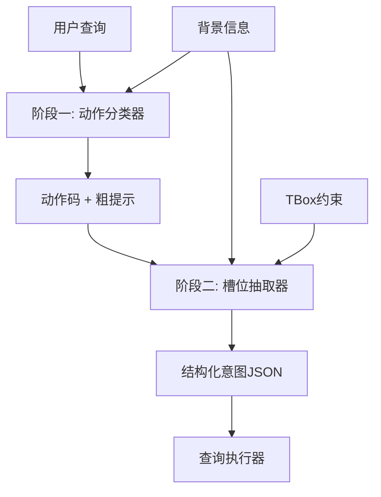

# 意图识别方案设计文档

## 1. 方案概述

### 1.1 背景与目标
在业务知识网络召回架构中，意图识别是连接用户自然语言查询与结构化知识图谱查询的关键环节。本方案旨在设计一个高效、准确的意图识别系统，能够将用户的自然语言问题转换为可执行的知识图谱查询指令。

### 1.2 核心挑战
- **语义理解复杂性**：用户问题表达方式多样，需要准确理解意图
- **动作类型多样**：涉及检索、扩展、确认、属性获取、路径查询、聚合、集合运算等多种操作
- **实体绑定准确性**：需要将抽象概念映射到具体的知识图谱实体
- **性能与成本平衡**：在保证准确性的同时控制推理成本

### 1.3 设计原则
- **分层处理**：采用两阶段设计，先粗分类后精细化
- **模型适配**：针对不同阶段选择合适规模的模型
- **可扩展性**：支持动态添加新的动作类型和对象类
- **容错机制**：提供降级策略和错误处理

## 2. 整体架构设计

### 2.1 两段式架构
```
用户查询 → 阶段一(动作分类器) → 阶段二(槽位抽取器) → 结构化意图
```

### 2.2 架构优势
- **职责分离**：阶段一专注动作识别，阶段二专注槽位填充
- **成本优化**：阶段一使用小模型，阶段二使用中等模型
- **准确性提升**：分步处理降低复杂度，提高识别准确率
- **可维护性**：模块化设计便于独立优化和调试

### 2.3 数据流设计


## 3. 阶段一：动作分类器设计

### 3.1 功能定位
- **主要职责**：将用户查询分类为9种基础动作类型
- **输出格式**：单字母动作码（R/E/C/A/P/G/S/H/Q）
- **辅助功能**：可选输出对象类和关系类的粗提示

### 3.2 动作类型定义
| 动作码 | 动作类型 | 描述 | 示例 |
|--------|----------|------|------|
| R | 检索(Retrieve) | 查找符合条件的对象实例 | "查找生产丙烯腈的企业" |
| E | 扩展(Expand) | 从已知对象扩展到关联对象 | "企业A在哪个园区？" |
| C | 确认(Confirm) | 判断是否存在某种关系或关联 | "企业A是否生产物料B？" |
| A | 属性(Attribute) | 获取对象的属性或字段信息 | "企业A的注册资本是多少？" |
| P | 路径(Path) | 查找对象之间的路径或连通性 | "企业A到企业B的合作路径" |
| G | 聚合(Aggregate) | 统计、排序或获取Top-K结果 | "园区内企业数量Top-5" |
| S | 集合(Set Operation) | 对比集合的交集、并集或差异 | "企业A与企业B的共同专利" |
| H | 复合(Hybrid) | 同时包含多个动作的复杂问题 | "展示企业A相关项目并列出专利Top-3" |
| Q | 澄清(Clarify) | 问题信息不足或语义不明确 | "帮我了解一下某企业的情况" |

### 3.3 模型选择与配置
- **推荐模型**：Qwen-3B/4B 或同等规模小模型
- **推理配置**：
  - `temperature=0`（确定性输出）
  - `top_p=0`（禁用采样）
  - `max_tokens=1`（单字符输出）
  - `stop=["\n", " "]`（防止多余输出）

### 3.4 提示词设计
采用系统提示词 + 用户提示词的分离设计：

**系统提示词**：
```
你是一个动作分类器。根据用户的问题和背景信息，将问题归类为以下动作之一，并只输出一个大写字母，禁止输出任何其他内容。

动作码：R=检索, E=扩展, C=确认, A=属性, P=路径, G=聚合, S=集合, H=复合, Q=澄清
```

**用户提示词**：
```
背景信息：[动态加载的对象类和关系类]
用户问题：[实际查询]
```

### 3.5 错误处理与降级
- **解析失败**：默认返回 `Q`（澄清）
- **置信度低**：可选返回Top-2动作码
- **超时处理**：设置3秒超时，超时返回 `Q`

## 4. 阶段二：槽位抽取器设计

### 4.1 功能定位
- **主要职责**：基于动作码和用户查询，抽取具体的槽位信息
- **输出格式**：结构化JSON，包含完整的查询参数
- **核心能力**：实体绑定、约束校验、默认值填充

### 4.2 输出Schema设计
```json
{
  "action": "string",           // 动作类型
  "object_class": "string",     // 主要对象类
  "entities": [],               // 实体列表
  "relations": [],              // 关系列表
  "attributes": [],             // 属性列表
  "constraints": {},            // 约束条件
  "aggregation": {},            // 聚合参数
  "limit": "number",            // 结果限制
  "clarification_needed": []    // 需要澄清的字段
}
```

### 4.3 模型选择与配置
- **推荐模型**：Qwen-14B 或 GPT-3.5-turbo
- **推理配置**：
  - `temperature=0.1`（轻微随机性）
  - 强制JSON模式输出
  - 结合JSON Schema校验

### 4.4 核心处理逻辑

#### 4.4.1 实体识别与绑定
- **命名实体识别**：从查询中提取企业名、物料名等
- **模糊匹配**：支持部分匹配和同义词处理
- **歧义处理**：多个候选实体时返回澄清请求

#### 4.4.2 关系约束校验
- **TBox校验**：基于知识图谱本体约束
- **类型兼容性**：确保实体类型与关系类型匹配
- **方向性检查**：验证关系的方向性

#### 4.4.3 默认值与补全
- **隐式参数**：为常见查询模式提供默认参数
- **上下文推理**：基于对象类推断可能的属性
- **限制条件**：为聚合查询提供合理的默认限制

### 4.5 提示词设计
```
你是一个槽位抽取器。基于动作码和用户查询，抽取结构化的查询参数。

输入：
- 动作码：{action_code}
- 用户查询：{user_query}
- 背景信息：{background_info}

输出要求：
- 严格按照JSON Schema格式输出
- 必须包含所有必需字段
- 对于不确定的信息，在clarification_needed中标注
```

## 5. 集成与优化策略

### 5.1 背景信息管理
- **动态加载**：根据查询内容动态选择相关的对象类和关系类
- **缓存策略**：对常用背景信息进行缓存
- **版本管理**：支持背景信息的版本控制和更新

### 5.2 性能优化
- **并行处理**：在条件允许时并行执行两个阶段
- **缓存机制**：对相似查询结果进行缓存
- **批处理**：支持批量查询处理

### 5.3 质量保证
- **A/B测试**：对比不同提示词和模型的效果
- **人工标注**：建立高质量的测试数据集
- **持续监控**：监控识别准确率和响应时间

### 5.4 扩展性设计
- **新动作类型**：支持动态添加新的动作类型
- **多语言支持**：预留多语言扩展接口
- **领域适配**：支持不同业务领域的定制化

## 6. 实施计划

### 6.1 第一阶段：基础实现
- 实现阶段一动作分类器
- 实现阶段二槽位抽取器
- 完成基本的集成测试

### 6.2 第二阶段：优化完善
- 优化提示词和模型配置
- 完善错误处理和降级机制
- 添加性能监控和日志

### 6.3 第三阶段：扩展增强
- 支持更多动作类型
- 优化背景信息管理
- 实现高级功能（如上下文记忆）

## 7. 风险与应对

### 7.1 主要风险
- **模型依赖性**：依赖外部LLM服务的稳定性
- **准确率波动**：不同类型查询的识别准确率可能差异较大
- **成本控制**：频繁调用可能导致成本过高

### 7.2 应对策略
- **多模型备份**：准备多个备选模型
- **渐进式优化**：基于实际使用数据持续优化
- **成本监控**：实施严格的成本控制和预警机制

## 8. 总结

本方案采用两段式LLM架构，通过职责分离和模型适配，在保证识别准确性的同时有效控制了成本。方案具有良好的可扩展性和可维护性，能够满足业务知识网络召回架构的需求。

通过分阶段实施和持续优化，预期能够达到90%以上的意图识别准确率，同时将平均响应时间控制在2秒以内。